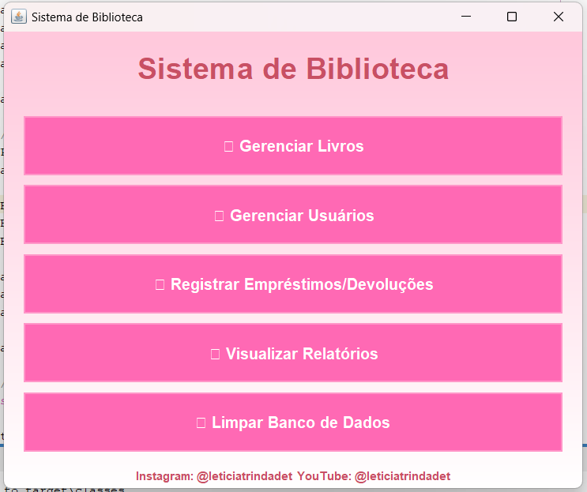
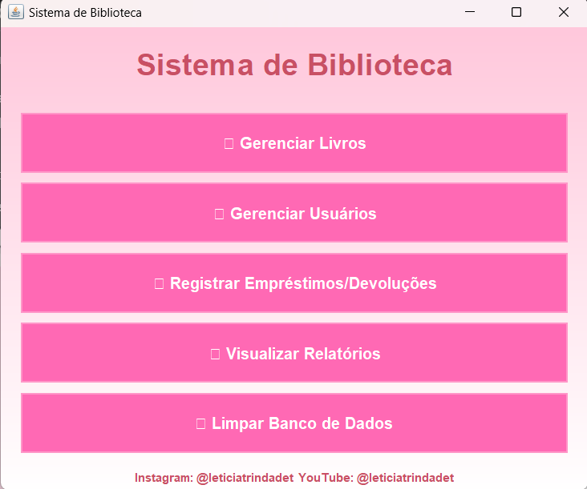
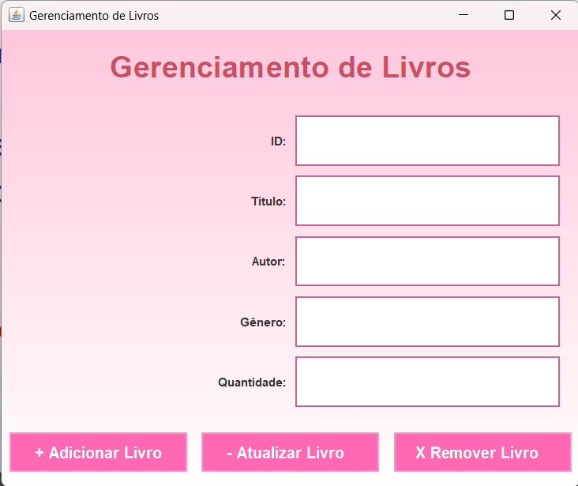
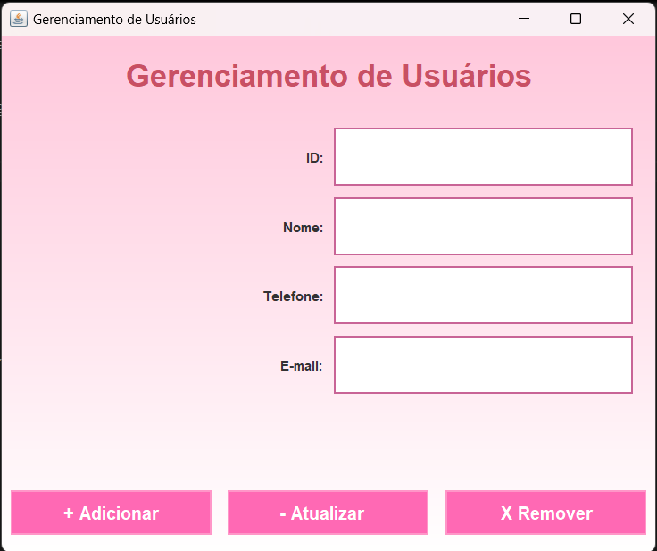
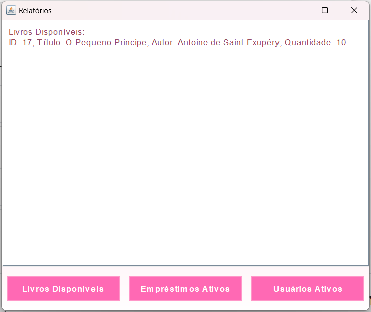

# 🌸 Sistema de Biblioteca 🌸  
*Gerenciamento de Livros, Usuários e Empréstimos*



Bem-vindo(a) ao **Sistema de Biblioteca**! 📚✨ Este é um projeto desenvolvido com muito carinho para gerenciar livros, usuários e empréstimos de forma simples e eficiente.  
> 🏫 **Exercício acadêmico** para a Licenciatura em Computação - **Leticia Trindade** 💖  

---

## 🛠️ Funcionalidades  

💾 **Cadastro e Gerenciamento de Livros**  
- Adicione, edite, liste e remova livros.  

👩‍💻 **Cadastro e Gerenciamento de Usuários**  
- Adicione, edite, liste e remova usuários.  

🔄 **Empréstimos e Devoluções**  
- Registre novos empréstimos e atualize seu status (devolvido ou pendente).  

📊 **Relatórios Fofinhos**  
- Visualize livros disponíveis, usuários ativos e empréstimos em andamento.

✨ **Banco de Dados Integrado**  
- Banco SQLite fácil de usar com tabelas configuradas automaticamente.  

---

## 🎨 Visual do Projeto

🌸 Aqui estão algumas telas para você sentir a fofura do sistema:

- **Tela Principal**  

 

- **Cadastro de Livros**  

 

- **Tela de Gerenciamento de Usuários**



- **Relatórios**  



---

## 🚀 Como Rodar o Projeto  

1. Clone o repositório:  
   ```bash
   git clone https://github.com/LeticiaTrindade/NomeDoRepositorio.git
